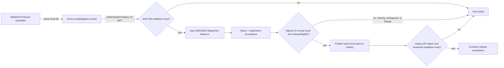

# MLX-90 Security publication Golden Path

This document defines the Producer side and the required ModuLix consumer
contract for the exact-byte Security publication path. It replaces the former
Galaxy-first transition no-op. It does not change the approval model for normal
releases.

## Policy split

| Release class | Runner | GitHub Environment | Publication rule |
| --- | --- | --- | --- |
| Evidence-bound MLX-90 Security release | `[self-hosted, linux, x64, incus]` | `mlx90-security-publish` | Zero-touch App dispatch; Nexus readback and signed ModuLix authorization are mandatory before Galaxy |
| Normal release | `ubuntu-latest` | `ansible-collections` | Existing protected human approval before publication |

The Security path is selected only from immutable metadata at the exact
protected-main SHA. A human `workflow_dispatch` cannot enter it because the
publish job additionally requires the exact
`lightning-it-release-automation[bot]` actor. The normal path never inherits
the zero-touch Environment.

Before classification, the workflow checks out the preparation receipt's
immutable base and requires exact-byte equality for the Security metadata,
intake receipt, and acceptance-profile registry. The centrally retained
`scripts/dispatch-transition-validation.py` is a baseline compatibility asset,
not part of this Golden Path; contract tests prohibit workflow use of it.

## Exact-byte sequence



The Nexus implementation uses the native Galaxy v3 hosted endpoint documented
by Sonatype:

`<repository-url>/api/v3/plugin/ansible/content/published/collections/artifacts/<artifact-name>`

Both `PUT` and authenticated `GET` address this exact URL. This path requires
Nexus Repository 3.93.1 or later because 3.93.1 contains the hosted-repository
and disable-redeploy corrections, with the `AnsibleGalaxyToken` realm enabled.
See the
[Sonatype Ansible repository documentation](https://help.sonatype.com/en/ansible-repositories.html)
and [native CLI/API examples](https://help.sonatype.com/en/ansible-cli-usage.html).

`scripts/nexus-galaxy-v3-stage.py` is idempotent only when the existing bytes
match. It rejects redirects, HTTP, credentials embedded in the URL, a URL that
does not end in the configured repository, unknown response codes, missing
credentials, unsafe candidate paths, and every readback size or digest
difference. It never writes a credential into an argument, artifact, or log.

## Producer configuration

The protected `mlx90-security-publish` Environment must provide all four
values. Empty values deliberately stop before any external publication.

| Type | Name | Meaning |
| --- | --- | --- |
| Variable | `NEXUS_GALAXY_REPOSITORY_URL` | Credential-free HTTPS URL ending in `/repository/<repository>` |
| Variable | `NEXUS_GALAXY_REPOSITORY` | Exact native `ansiblegalaxy` hosted repository name |
| Secret | `NEXUS_GALAXY_USERNAME` | Least-privilege publisher/readback identity |
| Secret | `NEXUS_GALAXY_PASSWORD` | Password or Nexus user-token secret for that identity |

The identity needs only upload, browse, and read privileges on that one hosted
repository. It must not receive repository administration privileges. The
Environment must also retain the existing Galaxy and release automation App
credentials. No personal access token is a supported fallback.

## ModuLix workflow dispatch contract

The Producer requires this exact active workflow on protected ModuLix `main`:

`.github/workflows/mlx90-collection-candidate-validation.yml`

Its workflow name is `MLX-90 collection candidate validation` and its run name
is `MLX-90 collection candidate / <request_id>`. It exposes exactly two
required string inputs:

- `request_id`: the lowercase 64-character SHA-256 of the canonical compact
  JSON in `request_json`;
- `request_json`: the complete v2 request with sorted keys and compact JSON
  separators.

The request contains no secret. It binds the Producer repository, exact source
SHA, workflow, run ID and attempt, Security Evidence ID, `humanActions: 0`,
candidate name/version/size/SHA-256, exact Nexus hosted repository URL and
artifact URL, and the exact ModuLix repository/ref/SHA/workflow. ModuLix must
recompute `request_id` before using any field.

Only installation `148019054` of App slug
`lightning-it-release-automation` may dispatch. The minted dispatch token is
restricted to `lightning-it/modulix-validation` and Actions write. Before
minting that scoped token, a separate read-only audit token is intentionally
minted without a repository subset. This is necessary because a subset-scoped
token would hide any accidentally installed extra repository from
`GET /installation/repositories`. The audit token therefore sees the entire
installation and proves its exact five-repository allowlist:
`shared-assets-lit`, `github-management-lit`,
`ansible-collection-supplementary`,
`container-ee-wunder-ansible-ubi9`, and `modulix-validation`. Its complete
installation permission map must be exactly Actions write, Checks read,
Contents write, Metadata read, and Pull requests write; `workflows` and every
administrative, Environment, secrets, or additional permission key must be
absent. The token itself requests only Actions read and expires after the job.
Producer rejects every mismatch before dispatch.

ModuLix must download the candidate from the request's Nexus URL using its own
protected Nexus read credential, independently prove the same size and digest,
execute both `heavy` and `application_acceptance`, and never rebuild or mutate
the candidate. The exact successful run must contain `Validate immutable
request`, `Nexus exact-byte readback`, one or more `Heavy / ...` jobs, one or
more `Application Acceptance / ...` jobs, and `Sign validation receipt`.
Every job in the run must complete successfully on the exact controller SHA;
a skipped or `continue-on-error` substitute is not accepted. ModuLix also
verifies the Producer run ID, attempt, workflow, repository, and SHA through
the GitHub API and records that immutable identity in the signed observations.

## Signed receipt v2

The successful run uploads exactly one non-expired artifact named
`mlx90-collection-validation-<request_id>`. It contains exactly:

- `mlx90-collection-validation-receipt.json`;
- `mlx90-collection-validation-receipt.json.sigstore.json`.

The receipt has these exact top-level fields:

- `apiVersion`: `lit.mlx90.collection-validation-receipt/v2`;
- `kind`: `CollectionValidationReceipt`;
- `requestId`: `sha256:<request_id>`;
- `request`: byte-semantic equality with the dispatched request object;
- `validation`: exact repository, workflow, main ref, controller SHA, run ID,
  attempt, App actor login, numeric bot ID and Bot type, event, success conclusion, artifact name,
  `humanActions: 0`, and observations;
- `decision`: exact-byte eligibility decision.

The observations are exactly:

```json
{
  "applicationAcceptance": "passed",
  "candidateDigest": "sha256:<candidate digest>",
  "heavy": "passed",
  "nexusReadback": "sha256:<candidate digest>",
  "sourceRun": {
    "actor": "lightning-it-release-automation[bot]",
    "actorId": 307565056,
    "actorType": "Bot",
    "event": "workflow_dispatch",
    "ref": "refs/heads/main",
    "repository": "lightning-it/ansible-collection-supplementary",
    "runAttempt": 1,
    "runId": 123,
    "sha": "<producer SHA>",
    "workflow": ".github/workflows/collection-publish.yml"
  }
}
```

The decision is exactly:

```json
{
  "candidateUnchanged": true,
  "galaxyPublicationAuthorized": true,
  "releaseEligible": true
}
```

ModuLix signs the canonical receipt with keyless Cosign identity
`https://github.com/lightning-it/modulix-validation/.github/workflows/mlx90-collection-candidate-validation.yml@refs/heads/main`.
The Producer verifies the GitHub OIDC issuer and the exact workflow SHA from the
matched run. A valid signature from another ref, SHA, workflow, or repository is
not accepted. This gate intentionally uses the verified Cosign bundle rather
than adding an App attestations permission; the existing Producer release
evidence remains separately GitHub-attested.

The Producer correlates the run using the exact custom run name, controller
workflow path, protected `main` ref and SHA, App actor and triggering actor,
repository and head repository, event, run ID, run attempt, completed status,
and successful conclusion. Zero matches time out; multiple matches stop as
ambiguous. It never accepts the old `collection-release-transition.yml`
transition receipt.

## Publication and evidence

Only after the signed receipt passes does the Producer invoke
`ansible-galaxy collection publish` for the unchanged local candidate. It then
requires the public Galaxy v3 metadata digest and downloaded bytes to match the
same SHA-256. The signed Producer post-publication receipt records the Nexus
readback digest, ModuLix request/receipt digest and run identity, and
`humanActions: 0`. The private Nexus staging manifest and verified ModuLix
receipt are retained in the Producer workflow artifact, without credentials.

## Operational prerequisites and fail-closed status

The path cannot be called operational until all of the following are true:

1. Nexus is at least 3.93.1, the `AnsibleGalaxyToken` realm is active, and the
   exact hosted `ansiblegalaxy` repository exists with
   immutable/redeploy-disabled policy.
2. The four Producer Environment values above are configured without required
   human reviewers for the Security-only Environment.
3. A runner with all labels `self-hosted`, `linux`, `x64`, and `incus` is online.
4. ModuLix implements the exact v2 workflow, its protected Nexus read
   credential, both validation profiles, and keyless receipt signing.
5. A fresh evidence-bound Security release proves the complete sequence and
   final `humanActions=0`; historical transition-mode runs are not acceptance.

Until then the implementation intentionally waits or fails before Galaxy. No
GitHub-hosted fallback, Galaxy-first fallback, manual approval substitution,
personal token, transition no-op, or permission expansion is permitted.
